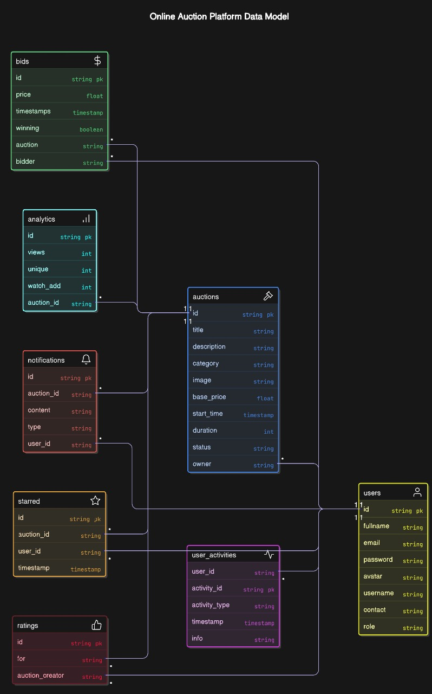
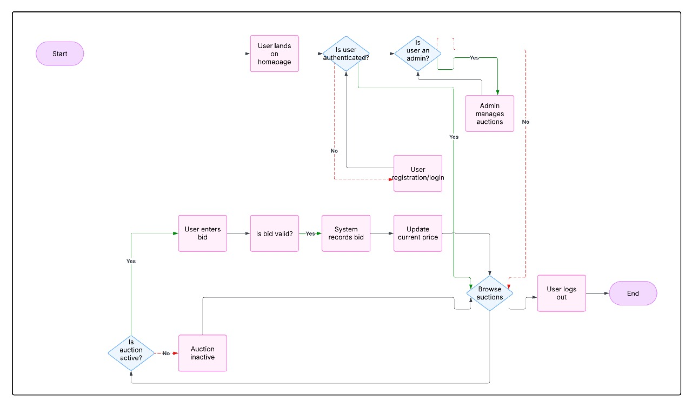
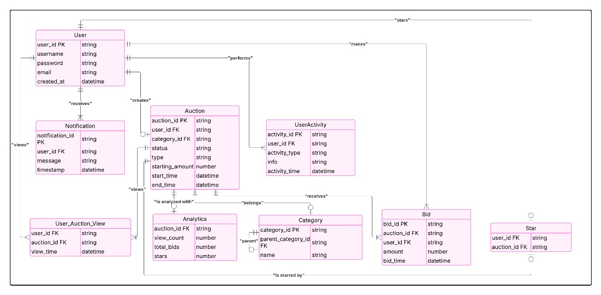
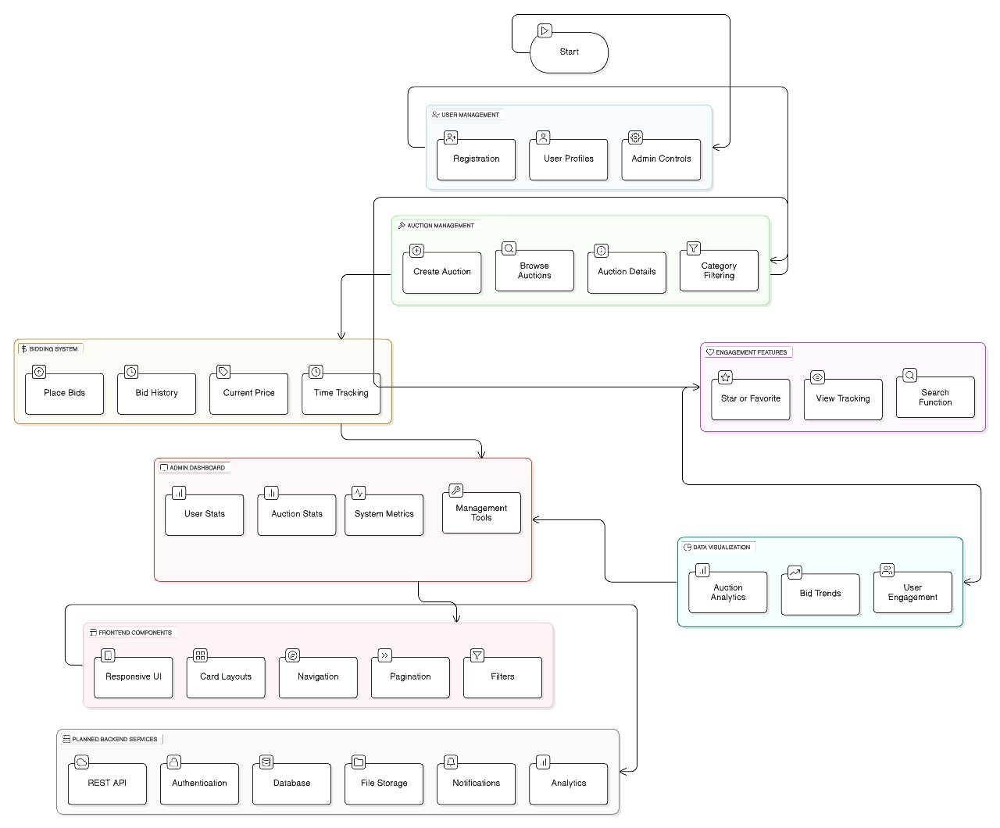

# BidBlitzz

BidBlitzz is an online auction platform where users can participate in bidding, manage auctions, and track their activities through a modern, interactive interface.

## 🚀 Live Demo
[Click here to view the live project](https://dbms-taupe-iota.vercel.app/)

## 📌 Features
- **User Authentication** – Secure login and registration
- **Auction Management** – Create, edit, and delete auctions
- **Bidding System** – Real-time bid placement and updates
- **Admin Dashboard** – Manage users, auctions, and reports
- **Notifications** – Alerts for bid updates and auction outcomes
- **Analytics** – Track auction performance and user engagement
- **Dark Mode** – Modern UI theme for better usability

## 📊 Project Diagrams

### 1. Database Schema

### 2. System Architecture Diagram

### 3. Flowchart

### Dark Mode Data Model

## 🛠️ Tech Stack
- **Frontend:** HTML, CSS, JavaScript, React (if applicable)
- **Backend:** Node.js / Express (or your backend choice)
- **Database:** PostgreSQL / MySQL
- **Deployment:** Vercel

## 📄 License
This project is licensed for educational purposes.
